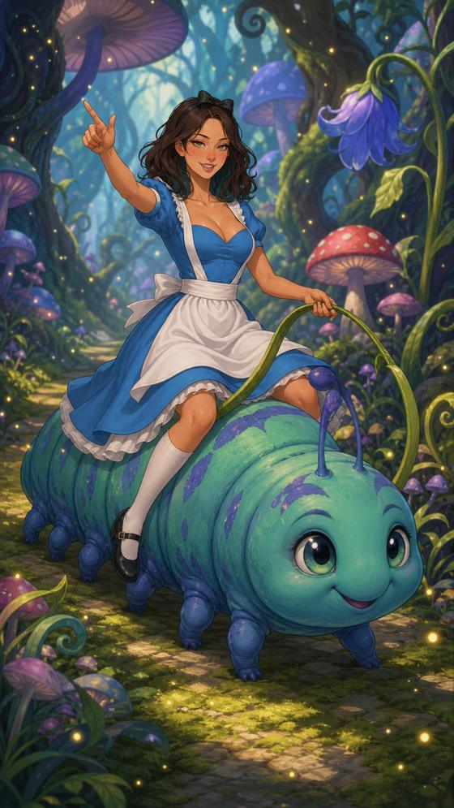
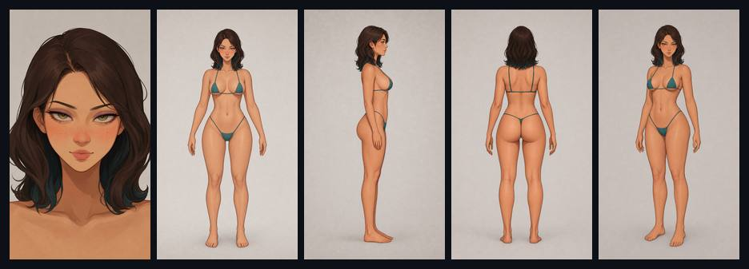
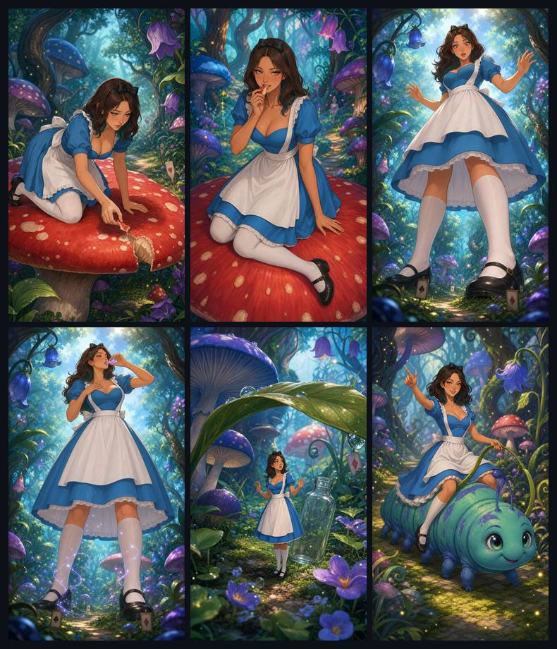

<p align="center">
  
</p>

<h1 align="center">StoryArt</h1>

<p align="center">
  Дайте проект ИИ-агенту, покажите свои референсы и опишите историю.<br>
  Агент поможет получить устойчивого персонажа и последовательные иллюстрации.
</p>

<p align="center">
  
  
  
</p>

StoryArt — не отдельная программа для рисования. Это готовая рабочая папка с правилами и инструментами для ИИ-агента, например Codex. Вы общаетесь с агентом обычными сообщениями, а он организует материалы, следит за внешностью героя и сохраняет результаты.

Проект также ограничивает скрытую подготовку: перед длительной работой агент фиксирует вашу исходную цель и ожидаемый видимый результат. Если подготовка превышает жёсткий лимит, агент обязан запустить уже готовый основной шаг или сразу показать конкретный блокер — продолжать бесконечный анализ нельзя.

## Как это работает

| Шаг | Что делаете вы | Что делает ИИ-агент |
|---|---|---|
| **1. Дали проект** | Открываете папку StoryArt в агенте | Читает правила и подготавливает рабочее окружение |
| **2. Дали данные** | Указываете папку со своими референсами | Анализирует стиль, лица, пропорции, одежду, свет и композицию |
| **3. Попросили** | Описываете персонажа или историю обычным языком | Подбирает нужные референсы, создаёт и проверяет кадры |
| **4. Получили** | Одобряете удачные варианты | Сохраняет персонажа и поддерживает его внешность в новых сценах |

## Начать за одно сообщение

1. Скачайте репозиторий через **Code → Download ZIP** и распакуйте его.
2. Откройте папку `StoryArt` в ИИ-агенте с доступом к файлам и генерации изображений.
3. Отправьте ему сообщение, подставив свой путь и описание:

```text
Это проект StoryArt. Подготовь его к работе и следуй инструкциям проекта.

Мои референсы находятся в D:\MyReferences.
Изучи все изображения, но не изменяй оригиналы и не добавляй их в Git.

Создай по ним локальный стиль MY_STYLE, а затем нового взрослого персонажа:
девушка с тёмными волосами и зелёными глазами, в мягком сказочном стиле.
Сначала покажи лицо, затем виды спереди, сбоку и сзади,
после чего собери нейтральный кадр 3/4.

Показывай результат каждого этапа и жди моего одобрения.
```

Агент сам изучит `README.md` и `AGENTS.example.md`, подготовит проект и проведёт работу по этапам. Команды Python и внутренние файлы вручную редактировать не нужно.

## Пример: дали данные → попросили → получили персонажа

В этом примере агенту дали:

- папку StoryArt;
- локальные референсы рисовки;
- текстовое описание взрослой Алисы;
- просьбу сохранить одно лицо и одни пропорции во всех ракурсах.

После поэтапного одобрения получился комплект из пяти связанных изображений: лицо, вид спереди, сбоку, сзади и нейтральная сборка 3/4.

<p align="center">
  
  <br>
  <sub>Реальные результаты проекта, показанные в виде облегчённой миниатюры.</sub>
</p>

Эти пять видов становятся опорой персонажа. В следующих запросах достаточно назвать утверждённого героя — агент сам выберет нужные изображения для сохранения внешности.

## Пример: попросили мини-историю → получили шесть кадров

Следующее сообщение агенту было уже намного короче:

```text
Используй утверждённого персонажа Алиса.
Лицо, волосы, цвет глаз, рост и пропорции не меняй.

Создай мини-историю 9:16 в одном сказочном грибном лесу:
1. Алиса отламывает кусочек красного гриба.
2. Пробует его.
3. Становится гигантской.
4. Выпивает уменьшающее зелье.
5. Становится крошечной рядом с огромными растениями.
6. Уезжает верхом на дружелюбной гусенице.

Сохраняй один костюм, палитру и непрерывность между кадрами.
Показывай каждый кадр отдельно и продолжай после моего одобрения.
```

Результат — последовательность из шести сцен с тем же персонажем:

<p align="center">
  
  <br>
  <sub>Все шесть реальных кадров собраны в одну лёгкую миниатюру для README.</sub>
</p>

## Что можно просить дальше

Пишите агенту так же, как человеку:

```text
Продолжи историю с последнего одобренного кадра.
```

```text
Создай новую сцену с Алисой в вечернем кафе. Лицо и пропорции не меняй.
```

```text
В последнем кадре изменилась внешность. Отклони его,
вернись к утверждённому персонажу и повтори сцену.
```

```text
Покажи последние результаты и объясни, какие из них уже одобрены.
```

## Где находятся ваши материалы

- `<STYLE>_PROJECT_PACK` — локальные референсы и описание стиля;
- `<STYLE>_GENERATIONS` — персонажи, сцены и одобренные варианты;
- `GENERATION_RESULTS` — архив созданных и отредактированных изображений.

Референсы, персонажи и полноразмерные результаты исключены из Git. В репозитории лежат только код, пользовательская инструкция и сильно уменьшенные демонстрационные миниатюры этой страницы.

## Что потребуется

- Windows и PowerShell;
- Python 3.10 или новее;
- ИИ-агент, который умеет читать локальные файлы, запускать команды и работать с генератором изображений.

Если агент попросил подготовить проект вручную, выполните в папке StoryArt:

```powershell
# Создаёт локальное окружение, устанавливает зависимость и проверяет проект.
.\scripts\bootstrap.ps1
```

Успешная подготовка заканчивается сообщением `STATUS=READY`.
